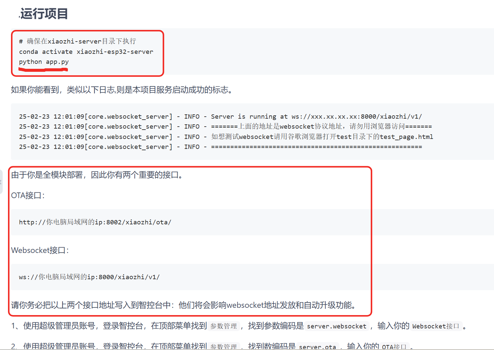

https://gitee.com/zhangzq0521/xiaozhi-esp32-server-bak/blob/main/docs/Deployment_all.md#1%E5%AE%89%E8%A3%85mysql%E6%95%B0%E6%8D%AE%E5%BA%93


语音识别模型

# 1. 下载项目源码
你先要下载本项目源码，源码可以通过git clone命令下载，如果你不熟悉git clone命令。
你可以用浏览器打开这个地址https://github.com/xinnan-tech/xiaozhi-esp32-server.git
打开完，找到页面中一个绿色的按钮，写着Code的按钮，点开它，然后你就看到Download ZIP的按钮。
点击它，下载本项目源码压缩包。下载到你电脑后，解压它，此时它的名字可能叫xiaozhi-esp32-server-main 你需要把它重命名成xiaozhi-esp32-server，在这个文件里，进入到main文件夹，再进入到xiaozhi-server，好了请记住这个目录xiaozhi-server。


# 2.项目启动环境及依赖的安装步骤：

======================================================================================
## 1.创建conda虚拟环境
conda create -n xiaozhi-esp32-server python=3.10


## 2.激活conda虚拟环境
conda activate xiaozhi-esp32-server

## 3.验证激活是否成功（命令行前缀会显示环境名）
# 输出示例：(xiaozhi-esp32-server) C:\Users\XXX>
python --version  # 应输出 Python 3.10.x

## 4.安装以来之前，先升级 pip（避免安装报错）
python -m pip install --upgrade pip

-----------------------------------------------------------------
## 退出虚拟环境
conda deactivate

## 删除虚拟环境（若需重建）
conda remove -n xiaozhi-esp32-server --all

## 查看所有 Conda 环境
conda info --envs

-----------------------------------------------------------------


## 5. 安装项目依赖
####  进入到你的项目根目录，再进入main/xiaozhi-server
cd main/xiaozhi-server
pip config set global.index-url https://mirrors.aliyun.com/pypi/simple/
pip install -r requirements.txt


## 安装环境问题1： Windows系统安装 ffmpeg
```
项目（xiaozhi-esp32-server）必须依赖 ffmpeg 处理音频，系统找不到它 → 直接报错退出。


方式1：
------------------------------------------------------------------
直接执行安装命令
conda install -c conda-forge ffmpeg -y

验证是否安装成功
ffmpeg -version


方式2：如果方式1 安装失败，请尝试方式2。
------------------------------------------------------------------
如果不想用 conda，也可以用这个方法
去官网下载 Windows 版 ffmpeg：https://www.gyan.dev/ffmpeg/builds/ffmpeg-git-full.7z
解压，把里面 bin 文件夹路径加到系统环境变量 PATH

把 bin 目录加到系统环境变量
进入解压好的文件夹
找到里面的 bin 文件夹
复制 bin 文件夹的完整路径
例如：
D:\tools\ffmpeg-2025-xxxx-full_build\bin

重启终端，再运行项目


```
[ffmpeg 下载、安装、配置、基本语法、避坑指南（覆盖 Windows、macOS、Linux 平台）](https://cloud.tencent.com/developer/article/2529117)

[2025-09-21 FFmpeg安装以及其使用方法(deepseek)](https://www.cnblogs.com/iuniko/p/19103473)

[ffmpeg安装详解：从下载到验证的全面指南](https://baijiahao.baidu.com/s?id=1848097135750094026&wfr=spider&for=pc)


https://www.gyan.dev/ffmpeg/builds/

https://github.com/BtbN/FFmpeg-Builds/releases


## 安装环境问题2： 缺少 lzma 库
```
conda 环境缺少 lzma 依赖库导致的，是 Windows + conda 环境非常常见的问题
ImportError: DLL load failed while importing _lzma: 找不到指定的模块


一键修复方案（最快）
直接在你当前的环境里执行这2 条命令：

conda install -y liblzma

pip install librosa --force-reinstall

```


# 特别注意：以下是部分依赖未成功安装时，单独安装的命令：

-----------------------------------------------------------------
## 安装 funasr 模块
执行以下命令安装官方的 funasr 包：
### 使用 pip 安装 funasr
pip install funasr

### 如果下载速度慢，可使用国内镜像源（如清华源）
pip install funasr -i https://pypi.tuna.tsinghua.edu.cn/simple


### 验证安装是否成功
安装完成后，可在命令行中执行以下命令验证：
python -c "import funasr; print('funasr 安装成功！版本：', funasr.__version__)"
如果没有报错并输出版本信息，说明安装成功。


## 安装 aioconsole 模块
打开 Anaconda Prompt（或命令提示符 / 终端），激活你运行代码的 Python 环境（如 base 环境），执行以下命令安装：
### 基础安装（默认源）
pip install aioconsole

### 国内镜像源安装（下载更快）
pip install aioconsole -i https://pypi.tuna.tsinghua.edu.cn/simple

### 验证安装是否成功
安装完成后，执行以下命令验证：
python -c "import aioconsole; print('aioconsole 安装成功！版本：', aioconsole.__version__)"


## 安装 loguru 模块
激活你运行代码的 Anaconda 环境（base 环境即可，和之前安装 funasr、aioconsole 的环境保持一致），执行以下命令安装：
### 基础安装（默认源）
pip install loguru

### 国内镜像源安装（下载更快，推荐）
pip install loguru -i https://pypi.tuna.tsinghua.edu.cn/simple

### 验证安装是否成功
安装完成后，执行以下命令验证模块是否安装到位：
python -c "import loguru; print('loguru 安装成功！版本：', loguru.__version__)"

## 安装 opuslib_next 模块
打开 Anaconda Prompt（或命令提示符 / 终端），激活你运行代码的 Anaconda 环境（和之前安装 loguru、funasr 的环境保持一致），执行以下命令安装：
### 基础安装（默认 PyPI 源）
pip install opuslib-next

### 国内镜像源安装（下载更快，推荐）
pip install opuslib-next -i https://pypi.tuna.tsinghua.edu.cn/simple
⚠️ 注意：模块名是 opuslib-next（带连字符），但代码中导入的是 opuslib_next（下划线），这是 Python 包的命名规范，安装时用连字符、导入时用下划线是正常的，无需担心。

### 验证安装是否成功
安装完成后，执行以下命令验证模块是否安装到位：
python -c "import opuslib_next; print('opuslib_next 安装成功！版本：', opuslib_next.__version__)"


兜底方案：替换为纯 Python 的 Opus 库（避免系统依赖）
如果上述步骤仍失败，可改用无需系统库的 pyopus（功能和 opuslib_next 一致）：
# 卸载 opuslib-next
pip uninstall -y opuslib-next

## 安装 pyopus（纯 Python 实现，无系统依赖）
pip install pyopus -i https://pypi.tuna.tsinghua.edu.cn/simple
然后修改 core/utils/util.py 中的导入语句：
### 将 import opuslib_next 改为
import pyopus as opuslib_next

======================================================================================


# 3. window环境需要下载：opus.dll

## opus.dll下载地址
https://github.com/Krupskis/opus.dll

## 下载后配置与验证步骤
确认文件：右键 opus.dll → 属性 → 详细信息，核实 “处理器架构” 为 AMD64（64 位）。
放置路径（二选一）：
（1）全局生效（推荐）：复制到 D:\Anaconda3\Library\bin\；
（2）项目本地生效：复制到项目根目录 D:\PythonWorkSpace\xiaozhi-esp32-server\main\xiaozhi-server\。


======================================================================================

# 4. 整个python server的启动步骤：
##  1. 下载语音识别模型文件
本项目语音识别模型，默认使用SenseVoiceSmall模型，进行语音转文字。
因为模型较大，需要独立下载，下载后把model.pt 文件放在models/SenseVoiceSmall 目录下。下面两个下载路线任选一个。

线路一：阿里魔搭下载SenseVoiceSmall
线路二：百度网盘下载SenseVoiceSmall 提取码: qvna

# 2. 配置项目文件
使用超级管理员账号，登录智控台 ，在顶部菜单找到参数管理，找到列表中第一条数据，参数编码是server.secret，复制它到参数值。

server.secret需要说明一下，这个参数值很重要，作用是让我们的Server端连接manager-api。server.secret是每次从零部署manager模块时，会自动随机生成的密钥。

如果你的xiaozhi-server目录没有data，你需要创建data目录。 如果你的data下面没有.config.yaml文件，你可以把xiaozhi-server目录下的config_from_api.yaml文件复制到data，并重命名为.config.yaml
复制参数值后，打开xiaozhi-server下的data目录的.config.yaml文件。此刻你的配置文件内容应该是这样的：

manager-api:
  url: http://127.0.0.1:8002/xiaozhi
  secret: 你的server.secret值
把你刚才从智控台复制过来的server.secret的参数值复制到.config.yaml文件里的secret里。

类似这样的效果

manager-api:
  url: http://127.0.0.1:8002/xiaozhi
  secret: 12345678-xxxx-xxxx-xxxx-123456789000


# 5. 运行项目
## 确保在xiaozhi-server目录下执行
conda activate xiaozhi-esp32-server
python app.py
如果你能看到，类似以下日志,则是本项目服务启动成功的标志。

25-02-23 12:01:09[core.websocket_server] - INFO - Server is running at ws://xxx.xx.xx.xx:8000/xiaozhi/v1/
25-02-23 12:01:09[core.websocket_server] - INFO - =======上面的地址是websocket协议地址，请勿用浏览器访问=======
25-02-23 12:01:09[core.websocket_server] - INFO - 如想测试websocket请用谷歌浏览器打开test目录下的test_page.html
25-02-23 12:01:09[core.websocket_server] - INFO - =======================================================
由于你是全模块部署，因此你有两个重要的接口。


# 查看某个依赖是否安装：
### 方法 1：最简命令行检查（快速验证是否安装）
直接在终端执行以下命令，能快速判断是否安装了 mcp 相关包：

### 查看所有已安装的 mcp 相关包（含版本）
#### Windows 系统
pip list | findstr mcp

### 或（Linux/macOS 系统）
pip list | grep mcp

### 或更精准的查询（显示安装路径）
pip show mcp


# 注意事项
## mcp无法引入的问题
使用项目的依赖列表安装的mcp虽然会安装到虚拟环境，但是项目中的依赖列表中并没有mcp，因此，你需要手动安装mcp。
pip install mcp


 使用 PyPI 官方网站搜索
打开 https://pypi.org/。
在网站顶部的搜索框输入 mcp，然后按下回车键。
浏览搜索结果页面，查看是否有你需要的 mcp 包。若找到该包，点击进入包的详情页，在页面中能看到所有可用的版本信息，进而确认你想要的版本是否存在。


## markitdown无法引入的问题

清除缓存并重新安装：
有时候 pip 的缓存可能导致安装的库出现问题。可以先清除缓存，再重新安装：
pip cache purge

pip uninstall markitdown

pip show markitdown

pip install markitdown==0.1.3


环境变量或系统缓存问题
环境变量可能影响 Python 模块的搜索路径，或者系统缓存可能导致模块无法正确加载。

解决办法
更新环境变量：有时候，激活虚拟环境后环境变量没有正确更新。可以尝试关闭并重新打开命令行窗口，再次激活虚拟环境。
清除缓存：删除 Python 的缓存文件。在项目根目录下找到 .pyc 文件和 __pycache__ 文件夹并删除它们。
通过以上步骤逐一排查，应该能够解决 from markitdown import MarkItDown 无法引入的问题。


[xiaozhi-esp32-server与AI大模型训练集成：5步实现定制化模型方案](https://blog.csdn.net/gitblog_01425/article/details/149929100)
[如何快速搭建xiaozhi-esp32-server：Python运行时配置完整指南](https://blog.csdn.net/gitblog_00165/article/details/151553554)

### 项目注意事项：
#### 确保在这个虚拟环境里直接运行 app.py，不要双击，不要用其他方式，否则会出现各种问题。
比如：无法引入MarkItDown

#### 根本原因
##### （1）你在 xiaozhi-esp32-server 虚拟环境 安装了 markitdown
##### （2）但你 运行 app.py 时，用的是 Anaconda 的全局 Python
##### （3）两个环境互不通用 → 所以依然报错


### 项目的启动方式：
#### 1. 确保进入目录
cd D:\PythonWorkSpace\xiaozhi-esp32-server\main\xiaozhi-server

#### 2. 确保在虚拟环境中，直接运行
python app.py


